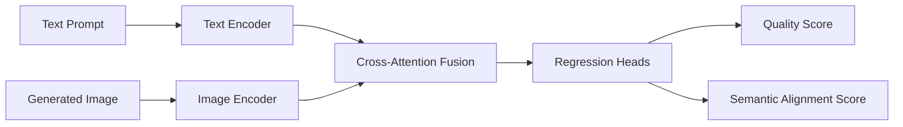

# AIGC MOS Predictor — Thesis Research Repository


Predicting perceptual quality (MOS) and semantic alignment for AI-generated images conditioned on text prompts.

## What is this

This repository documents my final-year ENSTTIC thesis research on objective quality prediction for AI-generated content (AIGC). The target is to estimate human-rated quality and text-image semantic consistency from a `(prompt, generated image)` pair.

## Why it exists

AIGC systems produce visually plausible images that vary significantly in perceptual quality and prompt faithfulness. Robust automatic evaluation helps benchmark generation systems and improve model development workflows.

## Problem definition

- **Input:** text prompt + generated image
- **Output 1:** predicted quality score (MOS proxy)
- **Output 2:** semantic alignment score between prompt and image

## Dataset and baselines

- **Dataset:** AGIQA-3K
- **Baselines:** IP-IQA, SF-IQA
- **Primary metrics:** PLCC, SRCC, KRCC

## Method overview

The planned model uses multimodal representation learning with cross-attention to explicitly model text-image consistency while preserving perceptual quality signals.



## Installation

This repository currently contains research documentation scaffolding while experiments are being organized for publication.

```bash
git clone https://github.com/fbenkhelifa/aigc-mos-predictor.git
cd aigc-mos-predictor
```

## Usage

### Current usage

- Review research scope, methodology, and metrics definitions
- Track literature and experiment planning from `docs/`
- Track data acquisition and preprocessing notes from `data/README.md`

### Planned usage (after code publication)

- Train/evaluate model on AGIQA-3K
- Report PLCC/SRCC/KRCC and baseline comparisons
- Export predicted quality/alignment scores for analysis

## Project structure

```text
aigc-mos-predictor/
├── README.md
├── .gitignore
├── LICENSE
├── data/
│   ├── README.md
│   ├── raw/
│   │   └── agiqa3k/
│   └── processed/
├── notebooks/
│   └── .gitkeep
├── reports/
│   └── .gitkeep
├── src/
│   └── .gitkeep
├── scripts/
│   └── download_data.md
└── docs/
    └── LITERATURE_INDEX.md
```

## Limitations

- Public training/inference code is not yet published.
- Experimental results are under active thesis development.
- Full dataset processing scripts will be released with reproducibility package.

## Roadmap

1. Finalize reproducible data preprocessing protocol for AGIQA-3K.
2. Publish baseline implementations and comparison scripts.
3. Release cross-attention model training/evaluation code.
4. Publish ablation study and metric analysis notebook.
5. Package inference workflow for prompt-image pair scoring.

## Academic status

Active thesis research at ENSTTIC Oran (Class of 2026, Telecommunications & Digital Technologies).

## License

Licensed under MIT. See [`LICENSE`](./LICENSE).
